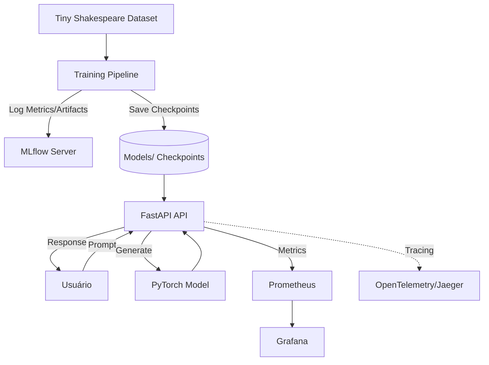

# MiniLLMOps


> Plataforma educacional completa de LLMOps para treinamento e serviço de um mini modelo de linguagem (GPT-style) do zero.

Este projeto demonstra o ciclo de vida completo de um projeto de LLM, desde a preparação dos dados e arquitetura do modelo até o treinamento, serviço via API e observabilidade de nível de produção. O modelo é um transformer "decoder-only" treinado no dataset Tiny Shakespeare.

## 📚 Sumário

- [🧭 Visão Geral](#visao-geral)
- [🏗️ Arquitetura](#arquitetura)
- [🔄 Fluxos do Projeto](#fluxos-do-projeto)
- [🧰 Tecnologias e Serviços](#tecnologias-e-servicos)
- [📁 Estrutura do Repositório](#estrutura-do-repositorio)
- [🚀 Instalação](#instalacao)
- [🧪 Como Usar](#como-usar)
- [🔎 Como Verificar Cada Serviço](#como-verificar-cada-servico)
- [📊 Observabilidade](#observabilidade)
- [✅ Testes e Coverage](#testes-e-coverage)
- [📖 Conceitos Teóricos](#conceitos-teoricos)
- [🛠️ Troubleshooting](#troubleshooting)

<a id="visao-geral"></a>

## 🧭 Visão Geral

O MiniLLMOps foca em ensinar os fundamentos de grandes modelos de linguagem (LLMs) através da implementação prática de um modelo de nível de caractere. O projeto cobre:

- Implementação de um Transformer personalizado em PyTorch.
- Pipeline de treinamento manual com rastreamento de experimentos via MLflow.
- Serviço de inferência autoregressiva via FastAPI.
- Coleta de métricas com Prometheus e visualização no Grafana.
- Tracing distribuído com OpenTelemetry.
- Containerização completa para implantação reprodutível.

<a id="arquitetura"></a>

## 🏗️ Arquitetura



<a id="fluxos-do-projeto"></a>

## 🔄 Fluxos do Projeto

### 🚂 Fluxo 1: Treinamento do Modelo

1. O pipeline carrega o arquivo `tiny_shakespeare.txt`.
2. O tokenizer de nível de caractere mapeia caracteres para inteiros.
3. O modelo Transformer (Decoder-only) é inicializado.
4. O loop de treinamento executa épocas, calculando a perda (loss).
5. O MLflow registra hiperparâmetros (lr, batch size) e métricas (loss, perplexity).
6. Checkpoints e o vocabulário são salvos no diretório `models/`.

### 💬 Fluxo 2: Inferência (Geração)

1. O usuário envia um prompt via `POST /generate`.
2. A API carrega o modelo e o vocabulário (se não estiverem em memória).
3. O prompt é codificado pelo tokenizer.
4. O modelo gera novos tokens de forma autoregressiva usando amostragem de temperatura e top-k.
5. Os tokens são decodificados de volta para texto.
6. A resposta é retornada ao usuário, e o trace da requisição é enviado ao Jaeger.

<a id="tecnologias-e-servicos"></a>

## 🧰 Tecnologias e Serviços

| Serviço | Tecnologia | Porta | Por que foi incluído | O que verificar |
|---|---:|---:|---|---|
| 🌐 API | FastAPI | `8000` | Serve predições do modelo e expõe métricas. | `/docs`, `/metrics`, `/generate`. |
| 🚂 Training | PyTorch | - | Engine de deep learning para o Transformer. | Logs do container de treinamento. |
| 🧾 Experimentos | MLflow | `5000` | Rastreia runs, métricas e artefatos. | Dashboards de experimentos e runs. |
| 📈 Métricas | Prometheus | `9090` | Coleta métricas da API. | Status dos targets. |
| 📊 Visualização | Grafana | `3000` | Visualiza latência e performance. | Dashboards de latência e request counts. |
| 🧵 Tracing | OpenTelemetry | - | Rastreia o fluxo da requisição (encodagem, inferência, decodagem). | Traces no Jaeger. |

<a id="estrutura-do-repositorio"></a>

## 📁 Estrutura do Repositório

```text
app/
├── api/                FastAPI application e endpoints
├── model/              Componentes do modelo Transformer (PyTorch)
├── training/           Lógica de treinamento e dataset
├── observability/      Configuração de Tracing, métricas e tracking
├── config/             Configurações globais
└── utils/              Funções utilitárias
data/                   Armazenamento do dataset (tiny_shakespeare.txt)
models/                 Checkpoints do modelo e vocabulário
tests/                  Testes unitários e de integração
docker/                 Dockerfiles e configurações de infra
docker-compose.yml      Stack completa
Makefile                Atalhos de comandos
requirements.txt        Dependências do projeto
```

<a id="instalacao"></a>

## 🚀 Instalação

### 📋 Pré-requisitos

- Docker e Docker Compose
- Python 3.11+
- `make` (opcional)

### 1. 🧩 Configurar ambiente

```bash
cp .env.example .env
```

### 2. 🐍 Venv (Opcional - para desenvolvimento local)

**Windows:**
```bash
python -m venv .venv
.venv\Scripts\activate
pip install -r requirements.txt
```

**Linux/macOS:**
```bash
python -m venv .venv
source .venv/bin/activate
pip install -r requirements.txt
```

<a id="como-usar"></a>

## 🧪 Como Usar

### 🚂 Treinar o Modelo

Para iniciar o treinamento via Docker:
```bash
make train
```
Isso salvará os checkpoints e o vocabulário no diretório `models/`.

### 🌐 Subir a API

Para rodar apenas a API:
```bash
make api
```

### 🐳 Subir a Stack Completa

```bash
make docker-up
```

### 💬 Testar Geração

```bash
curl -X POST http://localhost:8000/generate \
-H "Content-Type: application/json" \
-d '{"prompt":"To be or not to be"}'
```

<a id="como-verificar-cada-servico"></a>

## 🔎 Como Verificar Cada Serviço

### 🌐 FastAPI
- Health: `curl http://localhost:8000/health` (se implementado)
- Docs: `http://localhost:8000/docs`
- Metrics: `http://localhost:8000/metrics`

### 🧾 MLflow
- UI: `http://localhost:5000`
- Verifique se as runs de treinamento aparecem com as métricas de Loss e Perplexity.

### 📊 Grafana
- UI: `http://localhost:3000`
- Configure o datasource Prometheus (`http://prometheus:9090`) para visualizar métricas de latência.

<a id="observabilidade"></a>

## 📊 Observabilidade

- **Prometheus:** Coleta métricas da API via endpoint `/metrics`.
- **OpenTelemetry:** Utilizado para tracing distribuído, permitindo ver a latência de cada etapa (encoding, inference, decoding).
- **Structured Logging:** Logs em formato JSON para facilitar a análise.

<a id="testes-e-coverage"></a>

## ✅ Testes e Coverage

Para rodar os testes localmente:
```bash
make test
```

Para gerar relatório de coverage:
```bash
make coverage
```

<a id="conceitos-teoricos"></a>

## 📖 Conceitos Teóricos

### 🔤 Tokenizer
Usamos um tokenizer de nível de caractere personalizado. Ele mapeia cada caractere único no texto de treinamento para um número inteiro único. É a forma mais simples de tokenização, ideal para fins educacionais.

### 🧠 Transformer
O modelo é um Transformer "decoder-only" que utiliza:
- **Token Embeddings:** Mapeia IDs de tokens para vetores.
- **Positional Embeddings:** Aprende a posição de cada token na sequência.
- **Multi-Head Attention:** Permite ao modelo focar em diferentes partes da sequência simultaneamente.
- **FeedForward Network:** Uma MLP aplicada a cada token.
- **Layer Normalization:** Estabiliza o treinamento.

### 🎭 Causal Masking
No mecanismo de self-attention, usamos uma máscara causal (matriz triangular inferior). Isso garante que, ao prever o próximo token, o modelo veja apenas os tokens que vieram antes dele, impedindo que ele "cole" do futuro.

### 🔄 Geração Autoregressiva
A geração é feita um token por vez. O modelo prevê o próximo token, que é anexado à sequência e usado como entrada para a próxima predição. Suportamos amostragem de temperatura e top-k para controlar a aleatoriedade e qualidade do texto.

<a id="troubleshooting"></a>

## 🛠️ Troubleshooting

### ❌ Erro de "Model not found" na API
Certifique-se de que você executou o treinamento (`make train`) antes de subir a API, ou que existam arquivos `.pt` e `.pkl` válidos no diretório `models/`.

### 📈 MLflow não conecta
Verifique se o container `mlflow` está rodando e se a variável `MLFLOW_TRACKING_URI` no `.env` está correta.

### 🐳 Conflito de portas
Se as portas `8000`, `5000` ou `3000` estiverem ocupadas, altere os mapeamentos no `docker-compose.yml`.
